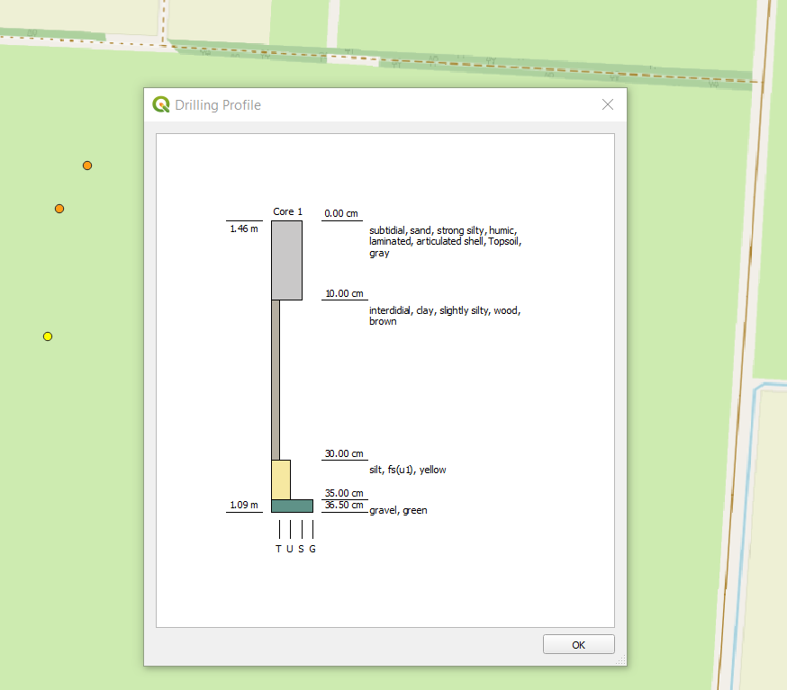

# geoCore

A QGIS Plugin

The plugin constructs a graphical representation of drillings.

geoCore was developed in cooperation with the Lower Saxony Institute for Historical Coastal Research (https://nihk.de/). The NIhK provides the domain specific knowledge and is key driver for the plugin's feature set.

In order to be able to interpret drill data correctly and in a comparable manner, the representation of the data as a borehole log (see. Fig. 1) is very important. The geoCore plugin offers the possibility to display and export drilling data from different sources and different disciplines highly flexible in its spatial context. In order to be able to draw the data, only the spatial data of the boreholes and the data of the individual strata are required. These are given according to a fixed definition. In order to do justice to the use of different signatures, the specific description of the layers can be defined in a yml file and thus adapted. The cores can be displayed individually or as transects with layer grouping. geoCore thus represents a significant improvement in the evaluation and processing options for coring in multidisciplinary projects.

## Dependencies

* PyYAML (https://pypi.org/project/PyYAML/)
* QGIS and PyQt (https://www.qgis.org)

## License

GNU General Public License v3.0 or later

See [LICENSE](LICENSE)

## Badges

